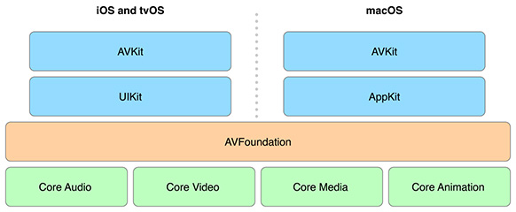

# LYPlayer

## Example

To run the example project, clone the repo, and run `pod install` from the Example directory first.

## Requirements

## Installation

LYPlayer is available through Private-Cocoapods [LYSpecs](https://github.com/blodely/LYSpecs). To install
it, simply add the following line to your Podfile:

```ruby
pod "LYPlayer"
```

## Design



## Author

[Luo Yu](http://luoyu.space), indie.luo@gmail.com

## License

LYPlayer is available under the MIT license. See the LICENSE file for more info.
